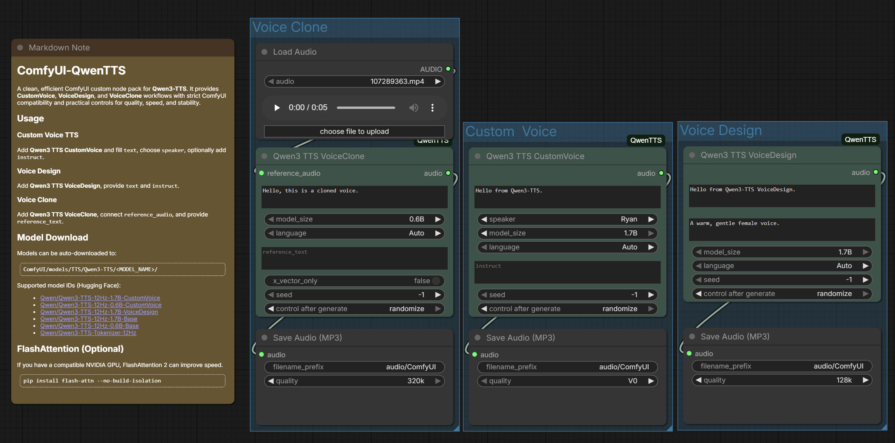

# ComfyUI-QwenTTS

A clean, efficient ComfyUI custom node pack for **Qwen3-TTS**. It provides **CustomVoice**, **VoiceDesign**, and **VoiceClone** workflows with strict ComfyUI compatibility and practical controls for quality, speed, and stability.


## Features

- **Custom Voice TTS**: Generate speech using preset speakers.
- **Voice Design**: Create voices from natural-language descriptions.
- **Voice Clone**: Clone voices from reference audio + transcript.
- **Multi-Device**: CUDA / MPS / CPU with auto device selection.
- **Local-First Loading**: Prioritize `ComfyUI/models/TTS/Qwen3-TTS/` when available.
- **Fine Controls**: Sampling knobs and max tokens (Advanced nodes).

## Model Overview (Qwen3-TTS)

- **Languages**: Chinese, English, Japanese, Korean, German, French, Russian, Portuguese, Spanish, Italian.  
- **Instruction control**: Supports voice style control via natural-language instructions.  
- **Tokenizer**: Uses Qwen3-TTS-Tokenizer-12Hz for speech encoding/decoding.  

## Model Matrix (12Hz)

| Model | Size | Features | Streaming | Instruction |
|---|---|---|---|---|
| CustomVoice | 1.7B | 9 premium timbres, style control | ✅ | ✅ |
| VoiceDesign | 1.7B | Voice design from descriptions | ✅ | ✅ |
| Base | 1.7B | 3s rapid voice clone, FT base | ✅ | - |
| CustomVoice | 0.6B | 9 premium timbres | ✅ | - |
| Base | 0.6B | 3s rapid voice clone | ✅ | - |
| Tokenizer | 12Hz | Speech encode/decode | - | - |

## Installation

### Method 1: ComfyUI-Manager (Recommended)
Open ComfyUI Manager → search **ComfyUI-QwenTTS** → install.

Install requirements in the ComfyUI-QwenTTS folder:
```bash
./ComfyUI/python_embeded/python -m pip install -r requirements.txt
```

> [!TIP]
>  If your environment cannot install dependencies with the system Python, use ComfyUI’s embedded Python instead:
> `./ComfyUI/python_embeded/python.exe -m pip install --no-user --no-cache-dir -r requirements.txt`

### Method 2: Clone into custom_nodes
```bash
cd ComfyUI/custom_nodes
git clone https://github.com/1038lab/ComfyUI-QwenTTS
```

Install requirements in the ComfyUI-QwenTTS folder:
```bash
./ComfyUI/python_embeded/python -m pip install -r requirements.txt
```

### Method 3: Comfy CLI
Make sure Comfy CLI is installed:
```bash
pip install comfy-cli
```

Install the node:
```bash
comfy node install ComfyUI-QwenTTS
```

Install requirements in the ComfyUI-QwenTTS folder:
```bash
./ComfyUI/python_embeded/python -m pip install -r requirements.txt
```

Restart ComfyUI after installation.

### Optional: FlashAttention 2 (Speed Up on CUDA)

If you have a compatible NVIDIA GPU, FlashAttention 2 can improve speed.

```bash
pip install flash-attn --no-build-isolation
```

> [!NOTE]
> Requires CUDA and `torch` built with a compatible CUDA version.
> Only works with `fp16`/`bf16` precision.

## Dependencies

Core dependencies (installed via `requirements.txt`):
- torch, torchaudio
- transformers, accelerate
- librosa, soundfile
- huggingface_hub
- sentencepiece, tiktoken

## Model Download

Models can be auto-downloaded to:
```
ComfyUI/models/TTS/Qwen3-TTS/<MODEL_NAME>/
```

Supported model IDs (Hugging Face):
- [Qwen/Qwen3-TTS-12Hz-1.7B-CustomVoice](https://huggingface.co/Qwen/Qwen3-TTS-12Hz-1.7B-CustomVoice)
- [Qwen/Qwen3-TTS-12Hz-0.6B-CustomVoice](https://huggingface.co/Qwen/Qwen3-TTS-12Hz-0.6B-CustomVoice)
- [Qwen/Qwen3-TTS-12Hz-1.7B-VoiceDesign](https://huggingface.co/Qwen/Qwen3-TTS-12Hz-1.7B-VoiceDesign)
- [Qwen/Qwen3-TTS-12Hz-1.7B-Base](https://huggingface.co/Qwen/Qwen3-TTS-12Hz-1.7B-Base)
- [Qwen/Qwen3-TTS-12Hz-0.6B-Base](https://huggingface.co/Qwen/Qwen3-TTS-12Hz-0.6B-Base)
- [Qwen/Qwen3-TTS-Tokenizer-12Hz](https://huggingface.co/Qwen/Qwen3-TTS-Tokenizer-12Hz)

If a model is missing locally, it will be downloaded automatically on first use.

### Model Folder Policy

All Qwen3-TTS assets are stored in one consistent location:
```
ComfyUI/models/TTS/Qwen3-TTS/<MODEL_NAME>/
```
This node will not download or create model folders elsewhere.

### Why So Many Files?

Qwen3-TTS follows the standard Hugging Face model layout (config, tokenizer, weights, etc.).
Multiple JSON/config files are required by Transformers at runtime, so they cannot be safely
collapsed into a single file without breaking loading.

### Manual Download (Recommended for Slow/Blocked Networks)

You can download models manually and place them into:
```
ComfyUI/models/TTS/Qwen3-TTS/<MODEL_NAME>/
```

Hugging Face CLI example:
```bash
pip install -U "huggingface_hub[cli]"

huggingface-cli download Qwen/Qwen3-TTS-Tokenizer-12Hz --local-dir ./Qwen3-TTS-Tokenizer-12Hz
huggingface-cli download Qwen/Qwen3-TTS-12Hz-1.7B-CustomVoice --local-dir ./Qwen3-TTS-12Hz-1.7B-CustomVoice
huggingface-cli download Qwen/Qwen3-TTS-12Hz-1.7B-VoiceDesign --local-dir ./Qwen3-TTS-12Hz-1.7B-VoiceDesign
huggingface-cli download Qwen/Qwen3-TTS-12Hz-1.7B-Base --local-dir ./Qwen3-TTS-12Hz-1.7B-Base
huggingface-cli download Qwen/Qwen3-TTS-12Hz-0.6B-CustomVoice --local-dir ./Qwen3-TTS-12Hz-0.6B-CustomVoice
huggingface-cli download Qwen/Qwen3-TTS-12Hz-0.6B-Base --local-dir ./Qwen3-TTS-12Hz-0.6B-Base
```

Then move each downloaded folder into:
```
ComfyUI/models/TTS/Qwen3-TTS/
```

### Manual Download via ModelScope (Mainland China)
```bash
pip install -U modelscope
modelscope download --model Qwen/Qwen3-TTS-Tokenizer-12Hz --local_dir ./Qwen3-TTS-Tokenizer-12Hz
modelscope download --model Qwen/Qwen3-TTS-12Hz-1.7B-CustomVoice --local_dir ./Qwen3-TTS-12Hz-1.7B-CustomVoice
modelscope download --model Qwen/Qwen3-TTS-12Hz-1.7B-VoiceDesign --local_dir ./Qwen3-TTS-12Hz-1.7B-VoiceDesign
modelscope download --model Qwen/Qwen3-TTS-12Hz-1.7B-Base --local_dir ./Qwen3-TTS-12Hz-1.7B-Base
modelscope download --model Qwen/Qwen3-TTS-12Hz-0.6B-CustomVoice --local_dir ./Qwen3-TTS-12Hz-0.6B-CustomVoice
modelscope download --model Qwen/Qwen3-TTS-12Hz-0.6B-Base --local_dir ./Qwen3-TTS-12Hz-0.6B-Base
```

## Usage



### Basic vs Advanced
- **Basic**: Minimal inputs, faster defaults (`do_sample=False`, `precision=bf16`).
- **Advanced**: Full control (sampling params, max_new_tokens, device/precision, unload).

### Custom Voice TTS
Add **Qwen3 TTS CustomVoice** and fill `text`, choose `speaker`, optionally add `instruct`.

### Voice Design
Add **Qwen3 TTS VoiceDesign**, provide `text` and `instruct`.

### Voice Clone
Add **Qwen3 TTS VoiceClone**, connect `reference_audio`, and provide `reference_text`.

### Advanced Nodes

Advanced nodes expose sampling controls and max token limits:
- **Qwen3 TTS CustomVoice (Advanced)**
- **Qwen3 TTS VoiceDesign (Advanced)**
- **Qwen3 TTS VoiceClone (Advanced)**

## Supported Speakers (CustomVoice)

We recommend using each speaker’s native language for the best quality.

| Speaker | Voice Description | Native Language |
|---|---|---|
| Vivian | Bright, slightly edgy young female voice | Chinese |
| Serena | Warm, gentle young female voice | Chinese |
| Uncle_Fu | Seasoned male voice with a low, mellow timbre | Chinese |
| Dylan | Youthful Beijing male voice with a clear, natural timbre | Chinese (Beijing Dialect) |
| Eric | Lively Chengdu male voice with a slightly husky brightness | Chinese (Sichuan Dialect) |
| Ryan | Dynamic male voice with strong rhythmic drive | English |
| Aiden | Sunny American male voice with a clear midrange | English |
| Ono_Anna | Playful Japanese female voice with a light, nimble timbre | Japanese |
| Sohee | Warm Korean female voice with rich emotion | Korean |

## Instruct Tips

Use full sentences (voice + emotion + pace). Examples:
- “Young female voice, slightly faster pace, upbeat tone, happy emotion.”  
- “Low-pitched male voice, slow pace, restrained tone, tired mood.”  
VoiceDesign and CustomVoice 1.7B respond best; 0.6B ignores `instruct`.

## Parameters (Advanced Common)

| Parameter | Type | Default | Description |
|---|---|---|---|
| text / target_text | STRING | - | Text to synthesize |
| language | COMBO | Auto | Language selection |
| device | COMBO | auto | auto / cuda / mps / cpu |
| precision | COMBO | bf16 | bf16 / fp16 / fp32 |
| max_new_tokens | INT | 2048 | Max codec tokens |
| do_sample | BOOLEAN | True | Enable sampling |
| top_p | FLOAT | 0.9 | Top-p sampling |
| top_k | INT | 50 | Top-k sampling |
| temperature | FLOAT | 0.9 | Sampling temperature |
| repetition_penalty | FLOAT | 1.0 | Reduce repetition |
| seed | INT | -1 | Seed (-1 for random) |
| unload_models | BOOLEAN | False | Clear cached models after run |

## Parameters (Advanced VoiceClone)

| Parameter | Type | Default | Description |
|---|---|---|---|
| reference_audio | AUDIO | - | Reference voice sample |
| reference_text | STRING | "" | Transcript of reference audio |
| x_vector_only | BOOLEAN | False | Clone with speaker embedding only |

If `x_vector_only` is `False`, `reference_text` is required.

## Outputs

- `AUDIO`: Generated speech (ComfyUI audio format).

## Device Selection

- **auto**: Prefer CUDA, then MPS, then CPU.
- **cuda**: Force CUDA if available.
- **mps**: Force Apple Silicon.
- **cpu**: CPU-only mode.
Note: `mps` is only available on macOS (Apple Silicon).

## Performance Tips

- Use `bf16` on CUDA for lower VRAM and faster speed.
- Lower `max_new_tokens` for shorter outputs.
- Use clean reference audio (5–15 seconds) for cloning.
- Basic nodes default to `do_sample=False` for faster, more stable output.

## Troubleshooting

- **Model download fails**: Check network or disk space, or download manually.
- **Dependency conflicts**: Use the pinned `huggingface_hub` range in `requirements.txt`. If your ComfyUI environment already has newer packages, install into a clean venv.
- **Out of memory**: Lower `max_new_tokens` or switch to CPU.
- **Clone quality**: Ensure reference text is accurate.
- **RAM warnings**: Some notes online refer to compiling FlashAttention from source. Inference does not require extreme system RAM.

## Model Information

- Model: Qwen3-TTS (12Hz tokenizer)
- Languages: 10 major languages (Auto supported)
- Weights License: Apache-2.0 (Qwen3-TTS)

## License

This project is licensed under the GPL-3.0 License.

## Credits

- Qwen3-TTS by Alibaba Qwen Team
- ComfyUI community

## Thank You & Support

Big thanks to the Qwen3-TTS team for open-sourcing the models and tooling that make this project possible.
If this node helps you, consider starring both the official Qwen3-TTS repo and this project to support continued development.

## Support

If you hit issues:
- Open an issue in this repo
- Include your ComfyUI